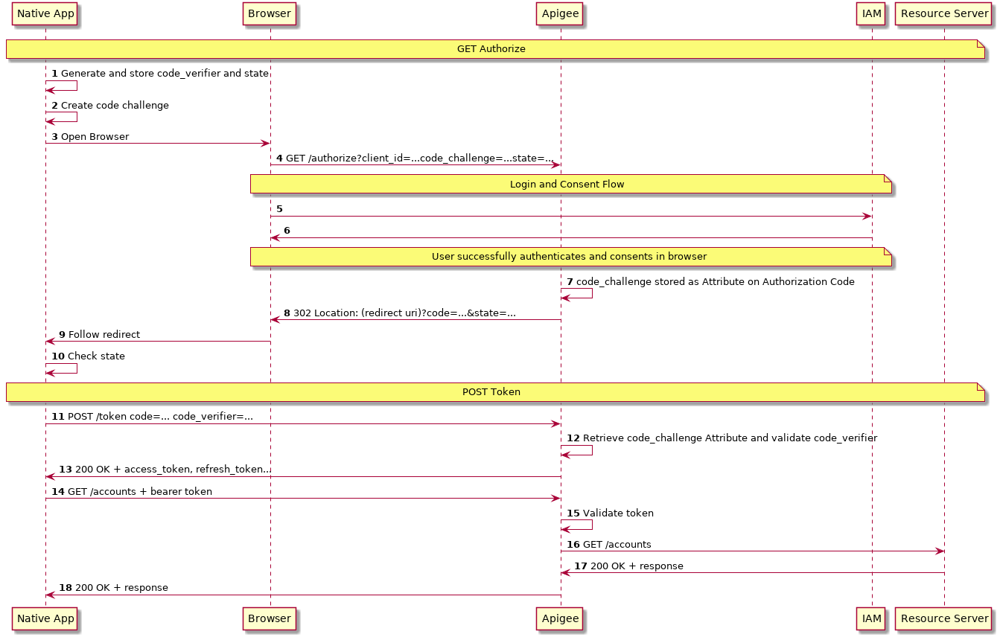

# Native App Security Design for Apigee

There is lots of debate on the correct way to use OAuth 2 with Native Mobile Apps. Before going any further, you should read the top answer on [this](https://stackoverflow.com/questions/17427707/whats-the-right-oauth-2-0-flow-for-a-mobile-app/38582630#38582630) StackOverflow question. It summarizes the key considerations on grant type, PKCE and Web View usage. You can now checkout [RFC8252](https://tools.ietf.org/html/rfc8252) for a full consideration of best practice.

The below example discusses the following:
- Authorization Code Grant Type
- PKCE
- Token Binding
- Dedicated Browser Views

## Flow Diagram



## PKCE Notes
1) Code Verifier is defined as
```
   code-verifier = 43*128unreserved
   unreserved = ALPHA / DIGIT / "-" / "." / "_" / "~"
   ALPHA = %x41-5A / %x61-7A
   DIGIT = %x30-39
```

2) Code Challenge is defined as
```
code_challenge = BASE64URL-ENCODE(SHA256(ASCII(code_verifier)))
```

4) Send a typical Authorize request, with the addition of `code_challenge`

10) The client should check that the state returned is the same as sent in step 4

12) Code verifier validation is 
```
BASE64URL-ENCODE(SHA256(ASCII(code_verifier))) == code_challenge
```

## Token Binding Notes

Token binding allows us to store some proof of identity against the generated access token. This allows us to test if a token has been stolen and is being used by another client. At the time of writing, there are a number of draft specifications for this. Specifications like [this](https://tools.ietf.org/html/draft-ietf-tokbind-protocol-14) require TLS extensions that may not be supported by many clients. As such, a simpler approach is to associate a client certificate fingerprint to a token, which may only be implemented if Mutual TLS is implemented.

Other implementations include digital signatures of tokens, however this was the approach taken for OAuth 1.0 and was generally disliked due to the complexity for clients and heavyweight implementation for servers. Until this area matures, we recommend sticking to RFC 8252 and implementing without token binding.


## Dedicated Browser Views

The following approaches are currently considered acceptable:
    - SFSafariViewController for iOS, not WKWebView or UIWebView
    - Chrome Custom Tabs for Android, not WebView
    - If in doubt, app switch to a browser

Again, please check RFC 8252 for further advice.
